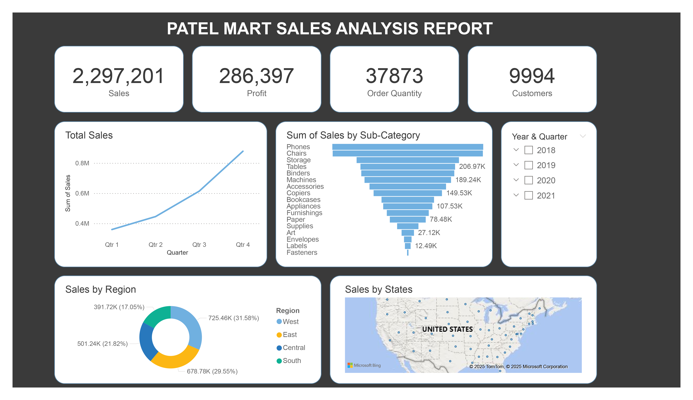

# 📊 Patel Mart Sales Analysis

## 📌 Introduction

As a data analyst, I conducted a **comprehensive sales performance review** for **Patel Mart**, a retail business with **multi-regional operations**. Using **Power BI**, I analyzed **sales trends, product performance, and regional contributions** to uncover **growth opportunities**.

### 🎯 Project Overview

**Objective:** Identify **sales trends**, **top-performing products**, and **regional strengths** to drive **data-backed business decisions**.

### 🛠 Tools Used:
- 📊 **Power BI** (Data cleaning, modeling, visualization)
- 🧮 **DAX** (Data Analysis Expressions for key metrics)
- 📈 **Interactive Dashboards** for dynamic reporting

### 📏 Key Metrics Analyzed:
✔ **Total Sales:** $2.29M  
✔ **Profit:** $286K  
✔ **Order Volume:** 37,873  
✔ **Customer Base:** 9,994  

## 🔍 Key Insights from the Analysis

### 1️⃣ Quarterly Sales Trends 📈

- **Q4 was the strongest quarter**, followed by **Q3**.
- **Q1 and Q2 underperformed**, suggesting **seasonal demand fluctuations**.

🔹 **Recommendation:**
- 🎯 **Run targeted promotions** in **Q1/Q2** (e.g., **discounts, loyalty rewards**).
- 📦 **Stock high-demand items ahead of Q4** to **maximize peak sales**.

### 2️⃣ Top & Underperforming Products 🛒

#### 🏆 Best-Sellers:
- 📱 **Phones** ($206K)
- 🪑 **Chairs** ($189K)
- 🗄 **Storage Solutions** ($149K)

#### 🐌 Lowest Performers:
- 🔩 **Fasteners**, 🏷 **Labels**, ✉ **Envelopes** (each **<$15K**)

🔹 **Recommendation:**
- 📢 **Increase marketing & shelf space** for **top categories**.
- 🔄 **Evaluate whether low-sellers should be discontinued or repositioned**.

### 3️⃣ Regional Sales Breakdown 🌎

- 📍 **South (31.58%)** & **Central (29.55%)** were the **highest revenue generators**.
- ❗ **West lagged (17.05%)**, indicating **untapped potential**.

🔹 **Recommendation:**
- 🔍 **Investigate why the South performs well** (e.g., better marketing, demographics).
- 📢 **Expand distribution or ad spend in the West** to **balance regional performance**.

### 4️⃣ Customer & Order Analysis 👥

- **~10,000 customers** with an **average order value of ~$60**.
- **Opportunity to increase repeat purchases** through **loyalty programs**.

🔹 **Recommendation:**
- 🎁 **Launch a rewards program** (e.g., **discounts for frequent buyers**).
- 🔄 **Upsell complementary products** (e.g., **phone accessories with phone purchases**).

## 📊 Data Visualization Techniques Used

To make the insights **digestible**, I implemented:
✅ **Bar charts** (Quarterly sales, regional performance)  
✅ **Horizontal bar graphs** (Product category rankings)  
✅ **Pie charts** (Regional sales distribution)  
✅ **Interactive filters** (Drill-down by time, region, product)  

📌 **Example:** The **“Sum of Sales by Sub-Category”** visualization clearly highlights **which products drive revenue**—helping **inventory teams prioritize stock**.

## 📈 Business Impact & Next Steps

This analysis helps **Patel Mart**:
✔ **Optimize inventory** by **focusing on high-margin products**.  
✔ **Improve regional strategies** to **boost underperforming areas**.  
✔ **Enhance customer retention** through **data-driven loyalty programs**.  

### 🚀 Future Analysis Ideas:
- 📊 **Customer segmentation** (Who are the **high-value buyers**?)
- 💰 **Profitability per product** (Are **best-sellers also the most profitable**?)
- 🎯 **Promotion effectiveness** (Do **discounts actually increase sales**?)

## 🏁 Conclusion

Data analytics **transforms raw numbers into actionable strategies**. By leveraging **Power BI**, I helped **Patel Mart** identify its **strengths, weaknesses, and growth opportunities**—proving that **smart data decisions lead to better business outcomes**. 🚀
